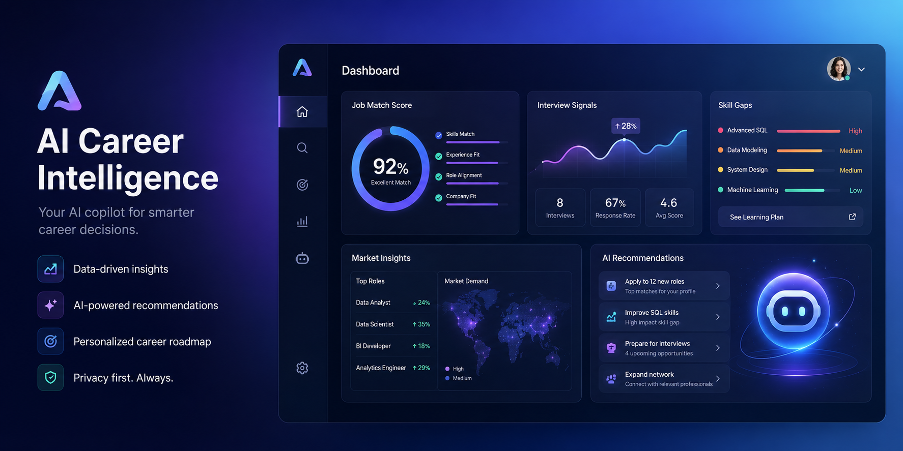

# CareerProof Agent



**CareerProof Agent** is a personal AI career concierge that turns job descriptions into evidence-based interview strategy for business, data, BI, product, operations, strategy, consulting, and AI/data product candidates.

> Generic AI gives answers. CareerProof builds evidence.

## Capstone Track

**Concierge Agents**

## Why this project exists

Job seekers do not only need more interview answers. They need help understanding what hiring managers are really evaluating, what business problem a role is hired to solve, and how to translate their real experience into credible proof.

CareerProof helps candidates move from vague, generic AI-generated answers to structured, role-specific, evidence-based preparation.

## What CareerProof does

Input:

- Target role
- Company
- Industry
- Job description
- Candidate profile / resume summary

Output:

1. Role Problem Map
2. Industry Context
3. Hiring Evidence Matrix
4. Candidate Proof Mapping
5. Interview Story Bank
6. Likely Interview Questions
7. Gap Analysis
8. 7-Day Prep Plan
9. Questions to Ask Interviewer

## Key features

- Personal career intelligence agent
- 25-industry interview knowledge base
- Hiring signal extraction
- Evidence mapping
- Privacy redaction for email, phone, and LinkedIn URLs
- Honest gap analysis that avoids fabricating experience
- Kaggle-ready writeup and docs
- Local eval dataset

## Industry coverage

CareerProof includes 25 industry knowledge packs:

1. Enterprise SaaS / B2B Software
2. AI / Data Product / MLOps
3. FinTech / Credit / Lending
4. Banking / Financial Services
5. Investment / Asset Management / WealthTech
6. Insurance / InsurTech
7. Healthcare Operations / HealthTech
8. Pharma / Biotech
9. Retail / E-commerce
10. CPG / Consumer Brands
11. Logistics / Supply Chain / Last-mile Delivery
12. Manufacturing / Industrial IoT
13. Energy / ClimateTech / Utilities
14. Real Estate / PropTech
15. Travel / Hospitality
16. Marketplace Platforms
17. Consumer Apps / Subscription Apps
18. Media / Streaming / Entertainment
19. Gaming / Interactive Entertainment
20. AdTech / MarTech
21. EdTech
22. HR Tech / Workforce / Recruiting
23. Cybersecurity
24. GovTech / Public Sector
25. Consulting / Strategy / Professional Services

## Architecture

```text
User JSON input
  ↓
CareerProof Agent
  ↓
privacy redaction
  ↓
job signal extraction
  ↓
industry matching
  ↓
evidence prompt construction
  ↓
Gemini reasoning
  ↓
structured career intelligence report
```

## Project structure

```text
careerproof-agent/
├── app/
│   ├── agent.py
│   ├── config.py
│   ├── schemas.py
│   ├── tools/
│   │   ├── privacy.py
│   │   ├── job_signals.py
│   │   ├── industry_map.py
│   │   └── evidence_mapper.py
│   └── data/
│       └── industries.json
├── specs/
│   └── careerproof.feature
├── docs/
│   ├── market_research_summary.md
│   ├── product_strategy.md
│   ├── ipo_platform_plan.md
│   ├── architecture.md
│   ├── industry_coverage.md
│   ├── kaggle_writeup.md
│   ├── demo_script.md
│   └── submission_checklist.md
├── tests/eval/datasets/basic-dataset.json
├── artifacts/sample_outputs/
├── assets/
├── Makefile
├── pyproject.toml
└── .env.example
```

## Setup

```bash
agents-cli install
```

Create `.env` from `.env.example`:

```bash
cp .env.example .env
```

Then add either your Google AI Studio API key or Vertex AI project settings.

## Run lint

```bash
make lint
```

## Run demo

```bash
make run-demo
```

Or run one industry-specific example:

```bash
make run-healthcare
make run-fintech
make run-marketplace
```

## Example input

```json
{
  "target_role": "Business Analyst",
  "company": "Healthcare operations company",
  "industry": "Healthcare Operations / HealthTech",
  "job_description": "We are looking for a Business Analyst to build dashboards, define KPIs, work with stakeholders, improve reporting processes, and translate data into recommendations. SQL, Excel, Power BI, and stakeholder communication are required.",
  "candidate_profile": "Candidate has experience at Uber Taiwan in operations, ERP implementation, cross-functional coordination with Product, Sales, CRM, PR, Legal, SKU expansion from 1000 to 3000, complaint rate reporting from 5% to 1%, and VisualSoft dashboard work using Python and Power BI improving decision efficiency by 30%."
}
```

## Market research foundation

Early qualitative survey responses suggest repeated pain points:

- Candidates do not know what hiring managers are really evaluating.
- Candidates struggle to connect past experience to target roles.
- Candidates need industry-specific context, not generic AI answers.
- Candidates want answer frameworks, business model explanations, role-specific questions, and experience-to-story translation.

## Long-term platform vision

CareerProof is designed as a wedge into a broader career intelligence platform:

1. Personal Career Intelligence Graph
2. Hiring Signal Intelligence Database
3. Industry Interview Knowledge Graph
4. Coach / Mock Interview Marketplace
5. University / Career Center Enterprise Version
6. API / Agent Marketplace Version

## License

MIT


## Streamlit Interactive Copilot

This repository includes a Streamlit web app for an interactive CareerProof Copilot experience.

Run locally:

```bash
pip install -r requirements.txt
streamlit run streamlit_app.py
```

Deploy on Streamlit Community Cloud using:

```text
streamlit_app.py
```

Add your Gemini API key in Streamlit secrets:

```toml
GOOGLE_API_KEY = "your_api_key_here"
```

If no API key is configured, the app runs in deterministic demo mode.
